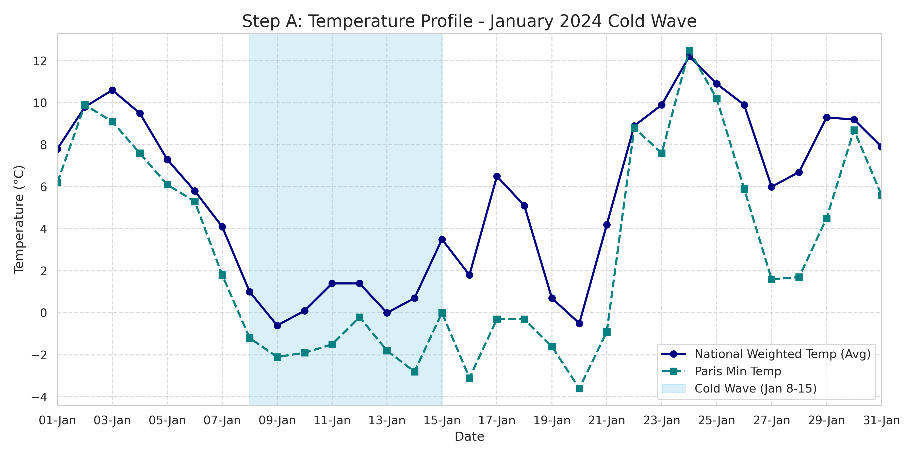
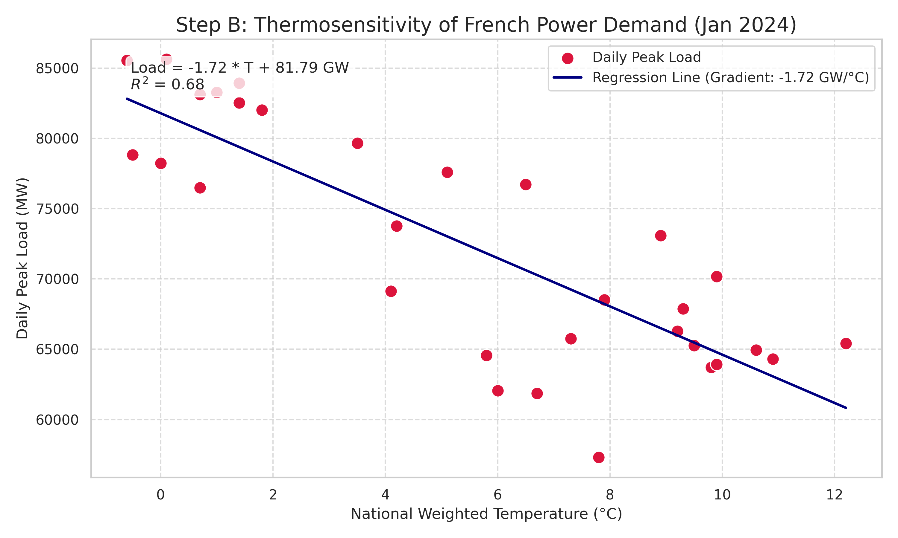
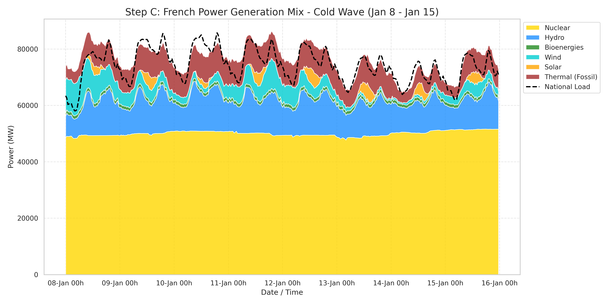
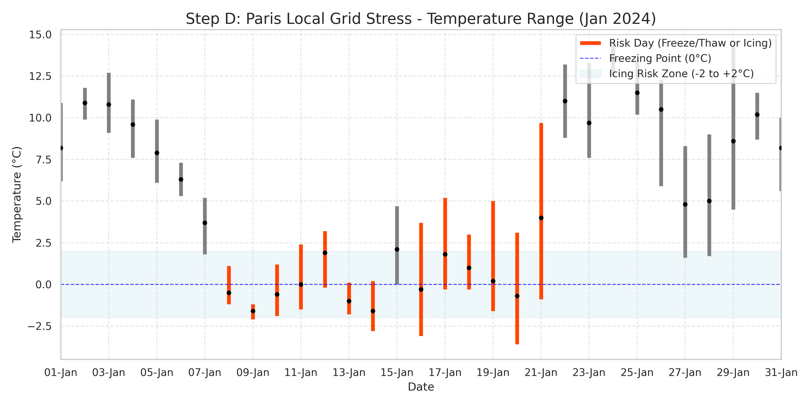

# The Impact of the January 2024 Cold Wave on the French Power System

**Author:** Feihong Li
**Date:** January 2026
**Institution:** Mines Paris (PSL)

---

## 1. Executive Summary

In January 2024, France experienced a significant cold wave event, particularly between **January 8th and January 15th**, characterized by temperatures dropping well below seasonal norms. This report analyzes the impact of this meteorological event on the French power system, focusing on demand sensitivity, supply mix dynamics, and local grid stress.

**Key Findings:**
*   **Thermosensitivity:** The national power demand showed a strong negative correlation with temperature, with a gradient of approximately **-1.72 GW/°C**. This confirms the high thermosensitivity of the French grid due to widespread electric heating.
*   **Supply Mix:** The grid successfully met the peak demand (reaching ~85.8 GW on Jan 10th) primarily through **Nuclear** and **Hydro** generation. Fossil fuel (Thermal) generation ramped up significantly to cover the gap, while Wind and Solar contributions were minimal during the peak ("Dunkelflaute").
*   **Local Stress:** The Paris region experienced several days of freeze/thaw cycles and temperatures hovering around 0°C, posing risks of icing on transmission lines.

---

## 2. Methodology

### Data Sources
*   **`eco2mix-national-cons-def.csv` (RTE):** Consolidated generation and consumption data (30-min resolution). Used for supply mix analysis.
*   **`pic-journalier-consommation-brute.csv` (ODRÉ):** Daily peak load and national weighted temperature. Used for thermosensitivity analysis.
*   **`ParisTEMP.csv` (Infoclimat):** Local weather data for Paris. Used for micro-impact assessment.

### Data Processing
1.  **Cleaning:** Dates were parsed to standard datetime objects. `eco2mix` data was filtered to remove empty 15-minute intervals, retaining valid 30-minute data points.
2.  **categorization:** Fossil fuel generation (Gas, Oil, Coal) was aggregated into a single **"Thermal (Fossil)"** category to highlight carbon-intensive peaking plants.
3.  **Integration:** Datasets were analyzed independently for specific metrics but aligned temporally to focus on the January 2024 timeframe.

---

## 3. Visual Analysis

### A. The Context: Cold Wave Identification

The chart above illustrates the temperature drop during the second week of January. The **blue shaded region (Jan 8 - Jan 15)** marks the core of the cold wave, where the National Weighted Temperature (Navy line) dropped significantly, accompanied by sub-zero minimum temperatures in Paris (Teal line). This period served as the focal point for the subsequent stress analysis.

### B. Macro Impact: Thermosensitivity

A linear regression of **Daily Peak Load** vs. **National Weighted Temperature** yields a gradient of **-1.72 GW/°C**.
*   **Interpretation:** For every 1°C drop in temperature, the national peak demand increases by approximately 1.72 GW. This reflects the massive use of electric heating in France.
*   **Grid Stability:** This high sensitivity necessitates precise load forecasting and sufficient dispatchable capacity to handle rapid demand surges during cold snaps. While the theoretical sensitivity is often cited as ~2.4 GW/°C during extreme cold, the observed -1.72 GW/°C for Jan 2024 indicates a robust but slightly lower response, possibly due to demand response measures or the specific nature of this cold spell.

### C. Supply Mix & "Dunkelflaute" Analysis

The **Stacked Area Chart** shows the power generation mix during the cold wave week.
*   **Base Load:** Nuclear (Yellow) provided the steady base load, running at high capacity.
*   **Flexible Generation:** Hydro (Blue) and Thermal (Brown) played crucial roles in meeting the daily peaks.
*   **Dunkelflaute Event (Jan 10th):** On January 10th at 19:00 (Peak Demand ~85.8 GW):
    *   **Wind + Solar Share:** Only **~4.0%** (3.4 GW). This clearly indicates a "Dunkelflaute" (Dark Wind Lull) condition.
    *   **Thermal Ramp-up:** Fossil fuel generation (Thermal) ramped up to **~10.0 GW** to compensate for the lack of renewables.
    *   **Imports:** The grid relied on imports (~3.6 GW) to balance the remaining load.

### D. Micro Impact: Local Grid Stress

The visualization of Paris daily temperature ranges highlights days with **Physical Grid Stress**.
*   **Risk Criteria:** Days where $T_{min} < 0°C$ and $T_{max} > 0°C$ (Freeze/Thaw) or temperatures remained within the -2°C to +2°C band (Icing Risk).
*   **Observation:** The chart identifies a cluster of risk days from **Jan 8 to Jan 14** and again from **Jan 16 to Jan 21**.
*   **Impact:** These conditions favor the accumulation of ice on overhead lines (galloping/icing) and mechanical stress due to thermal expansion/contraction cycles, increasing the risk of localized outages.

---

## 4. Conclusion

The January 2024 cold wave served as a stress test for the French power system. The grid demonstrated resilience, successfully meeting the 85+ GW peak demand without blackouts. However, the analysis highlights two critical vulnerabilities:
1.  **High Carbon Intensity during Peaks:** The "Dunkelflaute" event forced a heavy reliance on fossil fuel generation (10 GW Thermal), underscoring the challenge of decarbonizing peak demand during winter.
2.  **Weather Sensitivity:** The system remains highly sensitive to temperature (-1.72 GW/°C), and local infrastructure faces physical risks from freezing conditions.

Future resilience strategies must focus on enhancing demand-side flexibility (to reduce the GW/°C gradient) and diversifying storage/interconnection capabilities to mitigate renewable intermittency during cold, still weeks.
